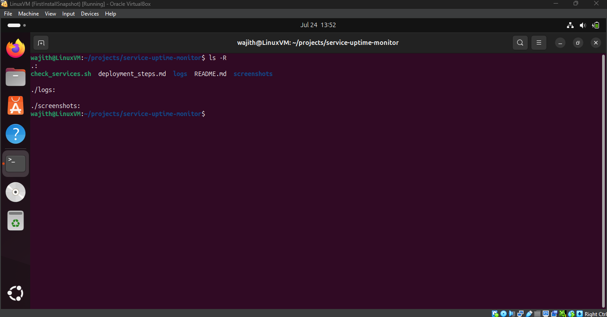
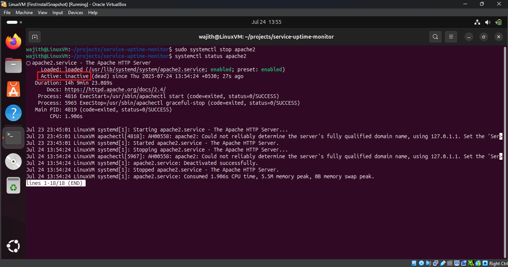
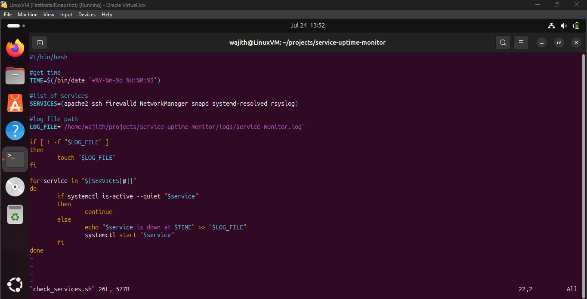
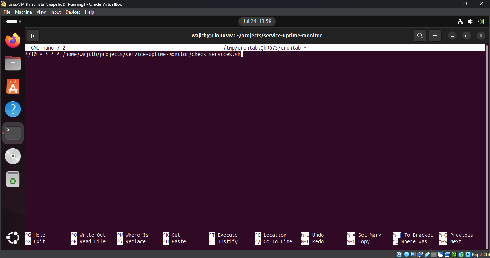
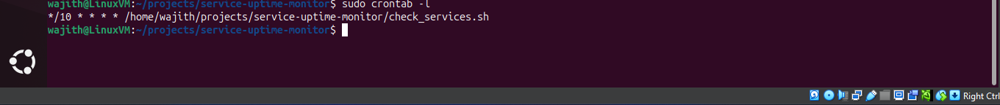
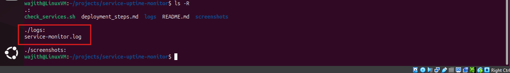
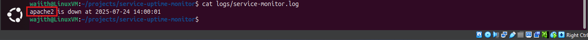
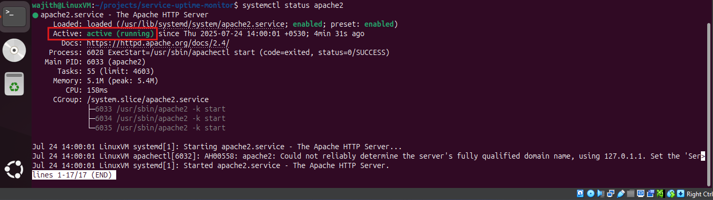

# Service Uptime Monitor

This project helps ensure critical Linux services remain active. It includes a Bash script that:

* Periodically checks if specified services are active
* Logs the time and name of services that are down
* Restarts any services found inactive

It uses `cron` for scheduling and creates a log file for audit purposes.

---

## Directory Structure

```
service-uptime-monitor/
├── check_services.sh         # The monitoring script
├── logs/
│   └── service-monitor.log   # Log file with downtime events
├── screenshots/              # Screenshots referenced in README
│   ├── empty_logs_directory.png
│   ├── log_file_created.png
│   ├── manual_service_stop_view_status.png
│   ├── script_check_services.png
│   ├── set_cronjob.png
│   ├── view_cronjob.png
│   ├── view_log_file.png
│   └── service_status_active.png
└── README.md
```

---

## Services Monitored

The following services are monitored:

* apache2
* ssh
* firewalld
* NetworkManager
* snapd
* systemd-resolved
* rsyslog

---

## Script Overview (`check_services.sh`)

```bash
#!/bin/bash

#get time
TIME=$(/bin/date '+%Y-%m-%d %H:%M:%S')

#list of services
SERVICES=(apache2 ssh firewalld NetworkManager snapd systemd-resolved rsyslog)

#log file path
LOG_FILE="/home/wajith/projects/service-uptime-monitor/logs/service-monitor.log"

if [ ! -f "$LOG_FILE" ]
then
        touch "$LOG_FILE"
fi

for service in "${SERVICES[@]}"
do
        if systemctl is-active --quiet "$service"
        then
                continue
        else
                echo "$service is down at $TIME" >> "$LOG_FILE"
                systemctl start "$service"
        fi
done
```

---

## Screenshots

| Screenshot                                                                              | Description                                            |
| --------------------------------------------------------------------------------------- | ------------------------------------------------------ |
|                          | Before stopping any service – `logs/` is empty         |
|  | Manually stopped `apache2` to simulate service failure |
|                        | Script that logs downtime and restarts services        |
|                                             | Cron job created to run script every 10 minute          |
|                                           | View of created cron job using `crontab -l`            |
|                                  | Log file created after service went down               |
|                                        | Viewing log file that contains downtime record         |
|                        | `apache2` automatically restarted by the script        |

---

## Cron Job Setup

To run the script every 10 minute:

```bash
crontab -e
```

Add the following line:

```bash
* * * * * /bin/bash /home/wajith/projects/service-uptime-monitor/check_services.sh
```

---

## Sample Log Output

```
apache2 is down at 2025-07-24 13:56:23
```

---
